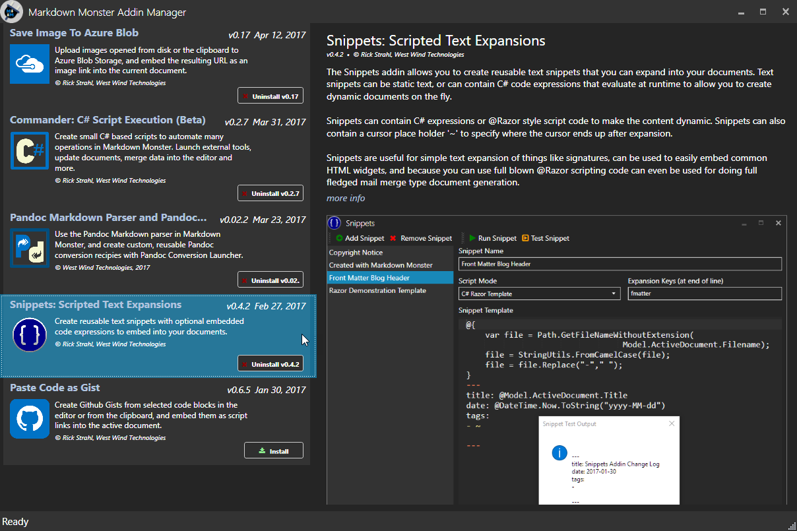

# Markdown Monster Addin Registry


### Publish your Markdown Monster Addins here
This repository is an Addin Registry for addins for the [Markdown Monster Markdown Editor for Windows](https://markdownmonster.west-wind.com).

This repository provides a list of available add-ins that are hosted via Git/Github and can be installed via the registry from within Markdown Monster via the [MarkdownMonsterAddinRegistry.json file](https://github.com/RickStrahl/MarkdownMonsterAddinsRegistry/blob/master/MarkdownMonsterAddinRegistry.json). You can publish your own add-ins that follow the addin guidelines in this document and publish it in this registry via pull request.

Right now the registry is pretty sparse as we are still working out the exact structure for addins, but a few add-ins have been added to get the ball rolling.

### The Addin Manager in Markdown Monster
Addins can be viewed and installed from Markdown Monster's Addin Manager accessible view **Tools -> Addin Manager**:



The `MarkdownMonsterAddinRegistry.json` file in this repository drives the list in the Addin Manager, with additional lookups in the individual repos `version.json` to retrieve current version info.

### Initial Addins available

* **[Save Image to Azure Blob Storage](https://github.com/RickStrahl/SaveToAzureBlob-MarkdownMonster-Addin)**  
This addin allows you to open images from the file system or from the clipboard and post them to an Azure Blob Storage account. The result image URL is then embedded into the currently open editor document.

* **[Paste Code as Gist](https://github.com/RickStrahl/PasteCodeAsGist-MarkdownMonster-Addin)**  
Allows you to paste a block of code as a Github Gist into your Markdown document. Gists are created on Github via API and the resulting embedding link is embedded into the Markdown document.

### Creating your own Addin and Adding to the Registry
Markdown Monster is extensible and you can [create your own Addins](http://markdownmonster.west-wind.com/docs/_4ne0rl1zf.htm) and if you think it might have more general appeal you can publish your Addin in this registry.

To publish your Addin:

* Create your Addin as a Github Repository
* Create a unique Id for your Addin (camel cased name)
* Make sure you provide a `\Build` and `\Build\Distribution` folder
* Make sure required files are provided (addin.zip, icon.png, version.json)

Once your repo has been set up:

* Clone this repository
* Add your Addin to the `MarkdownMonsterAddinRegistry.json`
* Open a Pull Request on this repo

If your pull request is approved and merged the addin will show in the addin manager inside of Markdown Monster and will be downloaded and installed from the Git repo.

### Markdown Monster Addin Git Repository Guidelines
In order to submit a Markdown Monster addin to the repository here you need to use a Git repo and publish your addin with source code and a **very specific structure** for your `\Build` folder.

The structure of the repo **has to include** the following folder and structure:

```
\              
    \Build
        addin.zip         // zip of Distribution folder   
        icon.png          // Square 256x256 PNG logo for addin
        version.json      // version info
        \Distribution     // compiled Addin DLLs and version
    \src
        <source files>    // source files for your addin      
Readme.md 
```
The filenames in the the `\Build` folder are fixed (addin.zip, icon.png, version.json).

The Distribution folder should look like this:

```
\Distribution
    yourAddin.dll         // name *must* end in <addinName>Addin.dll
    <dependency dlls)
    version.json          // same  file as Build folder
```

The `build\distribution` folder holds all files that into the Zip file. When you build your final output for the addin you'll build to the `Build\Distribution` folder and then zip all those files up into `Build\addin.zip`. The `Distribution` folder including all DLLs should be checked in to Git so it's easy to see what this addin uses in the open.

### version.json
`version.json` holds version and descriptive information about your addin. This file is queried in the addin list and if more information is requested about the addin. This file should live both in the `Build` folder so the Addin Manager can read it on a public URL, and embedded in the .ZIP file for determining the current installed version of your addin.

Here's what `version.json` should contain:

```json
{
    "id":SaveImageToAzureBlob",
	"name": "Save Image to Azure Blob",
	// in the build folder
	"download": "SaveImageToAzureBlob-MarkdownMonster-Addin.zip",
	// single paragraph, keep short and precise
	"description": "Allows uploading of images from disk or the clipboard to Azure Blob Storage, and embedding the resulting URL as an image link into the current document."
	"longDescription": "...",
	"icon": "AddIn.png",
	"version": "0.05",
	"author": "Rick Strahl - West Wind Technologies",	
	"updated": "2016-12-5T01:00:00Z"
}  
```

### The Zip File
The zip file of your add-in should contain all binaries needed to run the add-in but most definitely **should not include** any assemblies that are already loaded by Markdown Monster. Make sure you turn **Copy Local** on any files that Markdown Monster ships.

The Zip file basically should be all the files in the **Distribution** folder.

The following `build.ps1` (I put it in the `Build` folder) can automate creating the Zip file using 7zip (7z.exe/7z.exe also in [Build folder](https://github.com/RickStrahl/SaveToAzureBlob-MarkdownMonster-Addin/tree/master/Build)):

```powershell
cd "$PSScriptRoot" 

"Cleaning up build files..."
del addin.zip

remove-item -recurse -force .\Distribution
md Distribution


# change the folder below to match your bin folder
"Copying files..."
copy ..\PasteCodeAsGistAddin\bin\Release\PasteCodeAsGistAddin.dll .\Distribution

copy version.json .\Distribution

"Zipping up setup file..."
7z a -tzip  addin.zip .\Distribution\*.*
```

### Submitting to the Registry
* Create your addin and make sure you follow the Guidelines
* Fork this repository
* Update `MarkdownMonsterAddinRegistry.json` and add your Addin at the bottom
* Create a Pull Request and submit to the this repo

We'll review the entry and if accepted merge the pull request to get your add-in listed.

### Policy
We reserve the right to refuse admission of any submission for any reason whatsoever. 